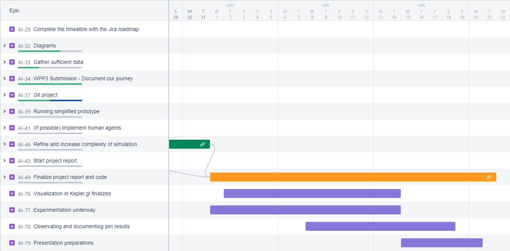

# Artificial Intelligence Software Agents

## Achievements

- 1.Version(03.03.2022):
  + A clear, detailed plan and direction for the semester.
  + We have collected enough data sheets to input the simulation.
  + We have started to implement the code for the tree and the environment.

- 2.Version(17.03.2022):
  + We have declared how much Agents will affect our Simulation: Humans, Trees, Animals, Terrain, and Weather
  + The Spawn Locations of the Tree will be decided on the QGIS map. It will be mapped as a .csv map with number from 0 to 3:
    + 0: the empty Location
    + 1: NutmegTree
    + 2: PalmTree
    + 3: BrazilNutTree
  + The Weather Data for the picked location is available
  + The Tree Agent, Tree Layer, Terrain layer, and Weather Layer are implemented and can be communicated with each other
  + Details UML about the Communication between Classes. 
  + The simulation method has been chosen and has been researched for the implementation.

- 3.Version(31.05.2022):
  + We have finished the model with Trees, Animals, Humans, Terrain and Weather.
  + We can see the interaction between them and see the effect of it. 
  + Simulation is prepared, but not at running state yet.

- 4.Version(24.06.2022):
  + Model is up and running; it is ready for the simulation with 3 Agents: Trees, Humans, and Animals.
  + Various tests are performed to find the most similar result to the real data.
  + We have gathered enough data for our comparision.
  + The visualization is run on kepler, a website that you can run real data on.
  + The research question will be ready as soon as we have the data after the simulation.
  
## 2 Week Goal: 
#Date (31.05.2022)
- All of the agents and layers to be implemented, up and running.
- Simulation to be implemented.

#Date (14.06.2022)
- The model to be visualized with the result from the simulation
- The research question to be be conducted with enough data

#Date (28.06.2022)
- The presentation should be done. 
- The project should be cleaned without any unused files. 
- Have final touches completed: comments on code and documentation.

## Research Question(s):
- What role do humans play in the growth of the rainforest? Would it make a big difference for the forest if humans were not included in the calculation?

## Topic: 
Simulation of all aspects that influence the rainforest in the past and compare it to the result with different configurations 

## Description
Our project will be a simulation of a scaled down version of the Amazon rainforest over the years (2002-2010) that displays the effects of deforestation. Our agents include trees, humans, and animals. Trees have the fields of age (seeding, juvenile, & adult), growth rate, amount of wood, type (palm, Brazil nut, or member of the nutmeg family), fruit production, is alive, seed distribution, and resistance to external factors. Humans have the actions of lumbering, planting seeds, moving, and harvesting fruit. Animals have the actions of eating fruit, pooping, dying, reproducing, and moving.
There are also external factors that affect the rainforest, including the weather. Weather includes rainfall, sunlight, humidity, and other factors such as flooding and forest fires.
This simulation is beneficial to the understanding of rainforests. Rainforests are rapidly being destroyed by many factors, many that can be limited to help protect the rainforests. With this simulation, knowing what specific factors that contribute most to the demolition of rainforests can help us find a solution for the quickly shrinking rainforests, as well as developing strategies for better forestation.
This would include finding a better balance for growing and dying trees. When we know the rates and factors that are contributing, we will be able to predict the future of rainforests if we continue to treat the rainforests the way we have been. And when we can predict the future using the current rates, we can proactively curb the rate of deforestation.

## Visuals
Simulation is done with ability to see locations on the map:

The current visualization state can be seen with the 2 simulation samples in .html format:
- 2 year simulation is viewable and settings are changeable.
- 8 year simulation is only viewable.
(It might take some time to load in the browser, be patient)

## How to Use
- You can change the Parameter for the Trees, Animals, and Humans in the .csv file so that you can either include all or just the trees and the animals
- The results of the tree will be showen in the /bin folder. 
- You will see a Tree.csv file there
- You will have to first convert the output to long and lat locations using the java-file in Resources/Scripts/src under the name "ConvertMap.java"
- On the Kepler Site the converted Tree.csv File shall be added for the input. 
- Set the long and lang param, to the x and y column. For proper visualization, set the colorization by the state of the tree.
- With a filter set to the datetime, you should see the progress of the tree growth throughout each tick which is a day in our simulation

## Usage
- Finding a better balance for growing and consuming trees
- Knowing what specific factors that contribute most to the demolition of rainforests

## Support
- Email:  dinh.nguyen@haw-hamburg.de
          asger.krabbe@haw-hamburg.de
          anne.krillenberger@haw-hamburg.de
          erik.weisgerberg@haw-hamburg.de
          yu.cheng@haw-hamburg.de

## Roadmap
View png named below.

## Authors and acknowledgment
Show your appreciation to those who have contributed to the project.

## License
Open source projects

## Milestones in git
- 26.04.2022: Basic Template for the project 
- 08.04.2022: Implementation of the Tree.cs and TreeLayer.cs
- 16.05.2022: Implementation of the Animal.cs and AnimalLayer.cs
- 17.05.2022: Implementation of the TerrainLayer.cs
- 24.05.2022: Implementation of the Human.cs and HumanLayer.cs
- 26.05.2022: Big changes to the structure of the model. All will be spawned on the ForestLayer and all of the input can be changed through the csv file
- 01.06.2022: First look of the visualization
- 13.06.2022: Continued improvement of functions that didn't work. Nearly everything is running as intend to.
- 20.06.2022: Found an important  Error in the Human.cs that it can't find the trees. 
- 21.06.2022: 
  * Added real map location for the simulation and the visualization. 
  * Added the Java Scrip that convert the map location to something that our model can understand.
- 23.06.2022: Human error is fixed. The Model is ready to run and be tested on.
- 26.06.2022: Changed all the input file so that it is similar to the real data. Delete not important file the Project.

## Project status
The base state is done and it contains all the basic functions of the rainforest. 

## All literatures are used for this project
- "Major shifts in Amazon wildlife populations from recent intensification of floods and drough"- Richard Bodmer
- "Modeling the Future Tree Distribution in a South African Savanna Ecosystem: An Agent-Based Model Approach" - Ulfia A. Lenfers, Nima Ahmady-Moghaddam , Daniel Glake , Florian Ocker, Julius Weyl and Thomas Clemen
- " Structure, density and rarity in an Amazonian rainforest bird community" -  Cambridge University Press
- "A spatial model of tree α-diversity and -density for the Amazon" - HANS TER STEEGE
